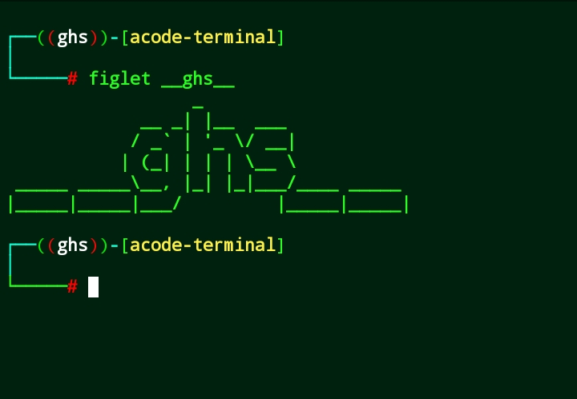
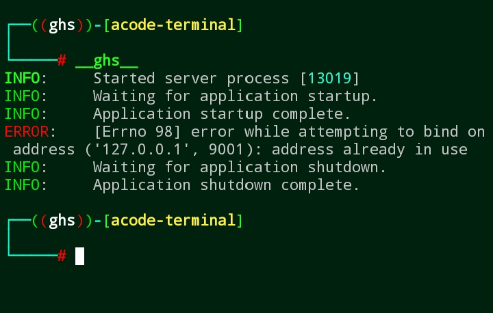
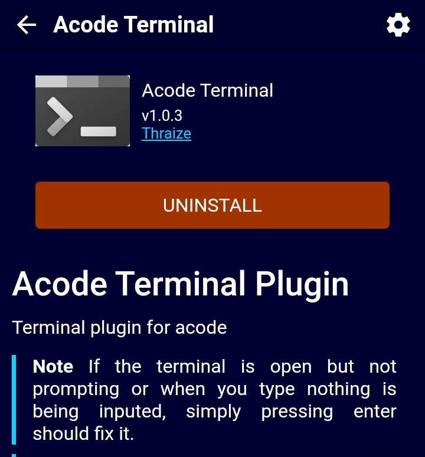
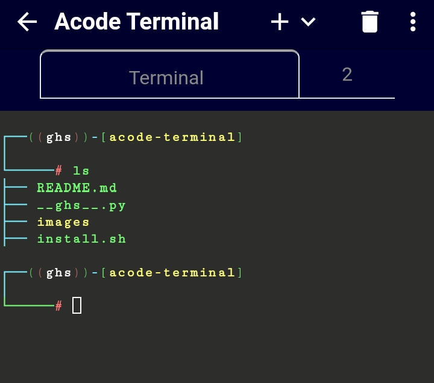

# Developer Ghs Julian 

<br/>


## Acode Terminal

--- 


**Hello user, welcome to my Acode Terminal . This tools has designed for more easily use for users . This is really awesome if you are willing to install this Repository please follow the commands bellow.**

---

## Command To Clone : 
```
pkg install git
git clone https://github.com/Ghsjulian/Termux-Tools.git
cd acode-terminal
bash install.sh
```
---

### Wow You Have Successfully Installed This Tools


<br/>


## Tools For Use : 

<br/>

**Now Type The Command In Your Termux And Press Enter**


<br/>


--- 

## How To Start Acode Terminal : 
```
__ghs__

```

<br/>


**You will see the server has started **

<br/>


---
--- 

<br/>


## Demo & Screenshots : 

<br/>


**Don't Forget To Follow Me**

<br/>
 
 
<center>
  
  <br/><br/>
  
  <br/><br/>
  
  <br/><br/>
  
  <br/><br/>
  <h2>Thank You 🙏❤️ </h2>
</center>
